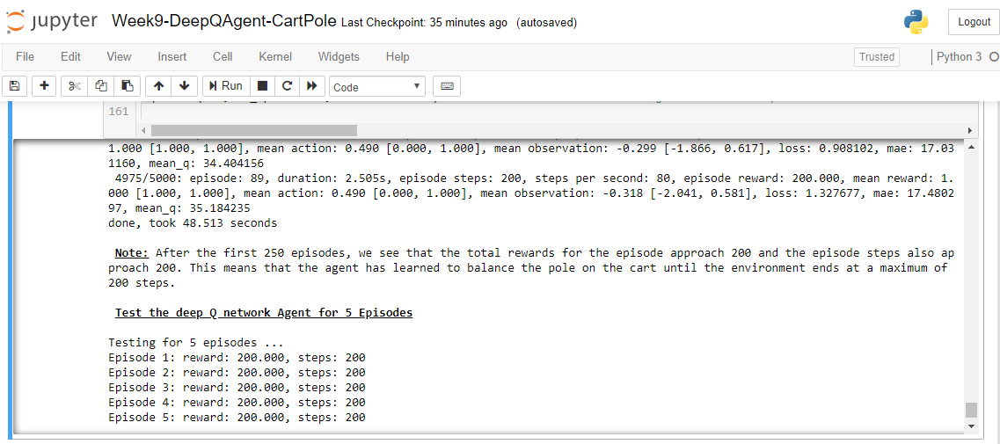
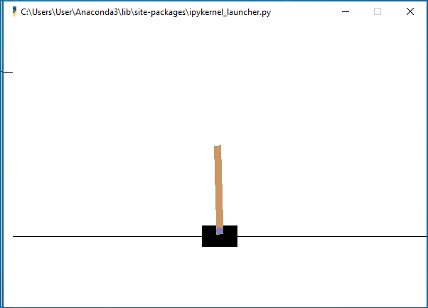

# Week9-Project: Develop and train a Keras-RL Reinforcement learning agent called CartPole 
- With assistance from https://gym.openai.com/docs/; https://keon.io/deep-q-learning/; https://github.com/keon/deep-q-learning and other DQN web tutorials
- Cart-pole problem - The CartPole environment consists of a pole, balanced on a cart. The agent has to learn how to balance the pole vertically, while the cart underneath it moves. The agent is given the position of the cart, the velocity of the cart, the angle of the pole, and the rotational rate of the pole as inputs. The agent can apply a force on either side of the cart. If the pole falls more than 15 degrees from vertical, it’s game over for our agent. 
- Starts with a Sequential model and build a simple 3 hidden layers neural network model with 16 neurons each that will later learn through reinforcement learning and solve the Cart-pole problem. The input is a 1 x state space vector and there will be an output neuron for each possible action that will predict the Q value of that action for each step. By taking the argmax of the outputs, choose the action with the highest Q value 
- Print the model summary 
- Plot the model and its Layers 
- Configure appropriate CartPole-v0 Environment Variables to benchmark the ability of reinforcement learning agent 
- From the CartPole-v0 environment, extract the number of actions available in the Cartpole problem. Use CartPole-v0 environment to benchmark the ability of reinforcement learning agent for solving the CartPole problem.
- Set policy as Epsilon Greedy and memory as Sequential Memory to store results of actions performed and rewards for each action 
- Now that we have a model and the memory (sequential) and policy (Epsilon Greedy) is defined, Create a DQN agent (Keras-RL Reinforcement learning agent) using Keras to master the CartPole-v0 environment and take several hundred episodes to eventually balance the pole 
- Compile the deep Q network Agent using Adam 
- Use Keras-RL callbacks that allow for convenient model checkpointing and logging. 
- Train the Reinforcement Learning DQN model using .fit() and 500 steps; Create training data through trials we run and feed this information into agent directly after running the trial. 
- Rather than training on the trials as they come in, Add them to memory and train on a random sample of that memory. By taking a random sample, we don’t bias our training set, and instead ideally learn about scaling all environments we would encounter equally well. 
- Set visualize=True to watch the agent interact with the environment 
- Test the Reinforcement Learning model using .test() method to evaluate for 5 episodes 
- Note that after the first 250 episodes, the total rewards for the episode approach 200 and the episode steps also approach 200. This means that the agent has learned to balance the pole on the cart until the environment ends at a maximum of 200 steps. 

